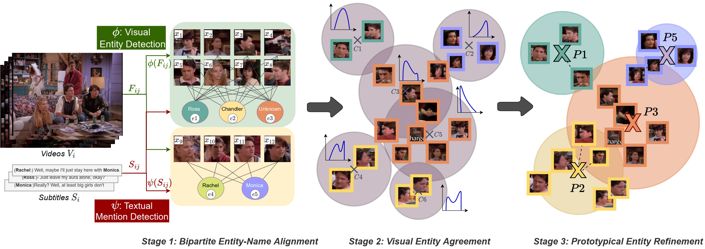
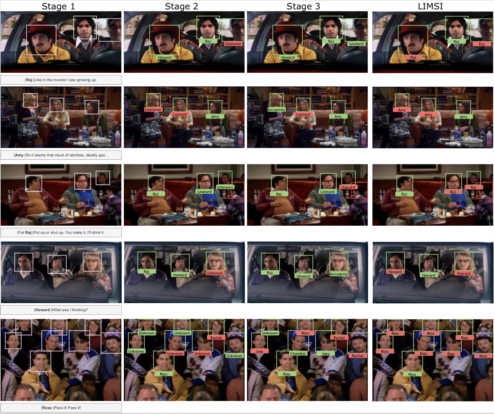

# Self-Contained-Video-Entity-Discovery
This is the official implementation and benchmark of the "Self-Contained Entity Discovery in Captioned Videos"  paper.

## Video Entity Discovery Task Definition:
Is it possible to uncover the visual entities occurring in a collection of captioned videos without requiring task-specific supervision or external knowledge sources? We introduce *self-contained video entity discovery*, where we seek to localize and align visual entities with named entities solely from corresponding captions. You can see the input of the model at the left side of this figure, which consists of video frames and their corresponding captions. The right side shows the localized visual entities with their correct named entities which are the expected outputs of the model.


## Method:
We propose a three-stage approach to tackle this problem:

###### Stage 1: Bipartite entity-name alignment.
First, mentions of named entities are extracted from textual descriptions and visual entity boxes from the corresponding frames. For each description-frame pair, a set of visual entity and named entity nodes are created and densely connected to form a collection of bipartite graphs, one graph for each description-frame pair, which provides initial cues about the entity names that correspond to boxes. However, this alignment is non-unique, incomplete, and noisy. The labels (i.e. names) assigned to each box after this stage are called {\em weak labels}.



###### Stage 2: Inter-box entity agreement. 
Second, we seek to improve the matching between visual entities from frames and named entities from textual descriptions by taking advantage of the visual similarities of box entities. This is done by over-clustering the visual embeddings and then using the alignments from the bipartite graphs of the previous stage to aggregate clusters into entity distributions. The most frequently occurring entity name is then selected as the new name for each box this is termed the {\em cleansed label}.

###### Stage 3: Prototypical entity refinement.
By aggregating the most-occurring entity name for each cluster, the most frequent entity name will be over-represented in the entity distribution. This aggregation biases the entity discovery towards most-frequent labels. As a third stage we address this bias by computing a per-entity prototype, followed by a refinement of the entity assignment for boxes of the most frequent prototype based on the minimal prototypical distance.

## How to use?
Further explanation will be added soon.

## Some Qualitative Examples:



### Citation
Please consider citing this work using this BibTex entry,

```bibtex

```
